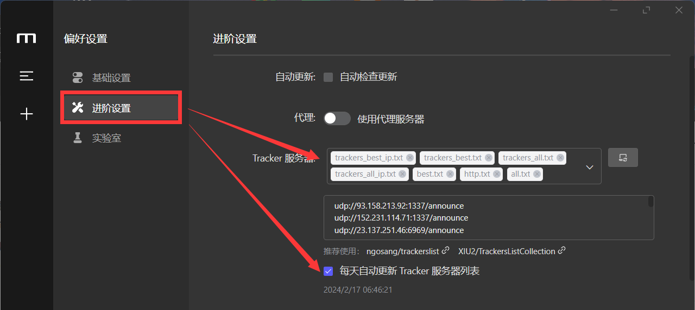
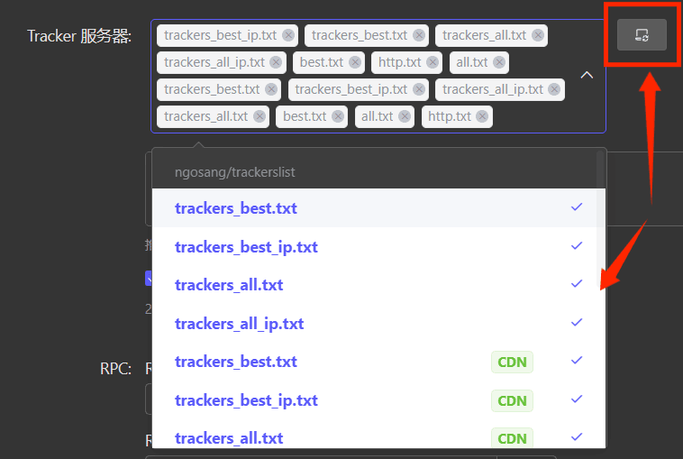
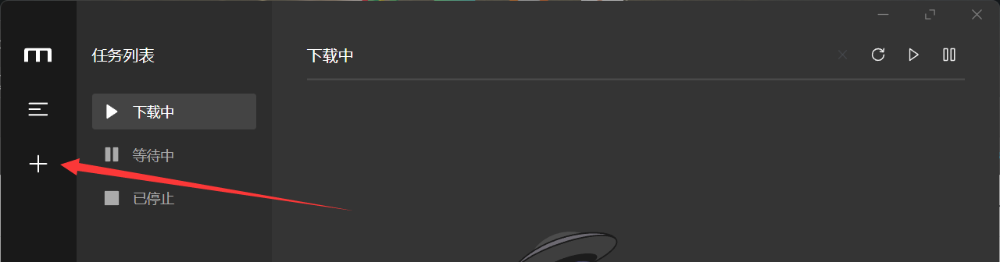
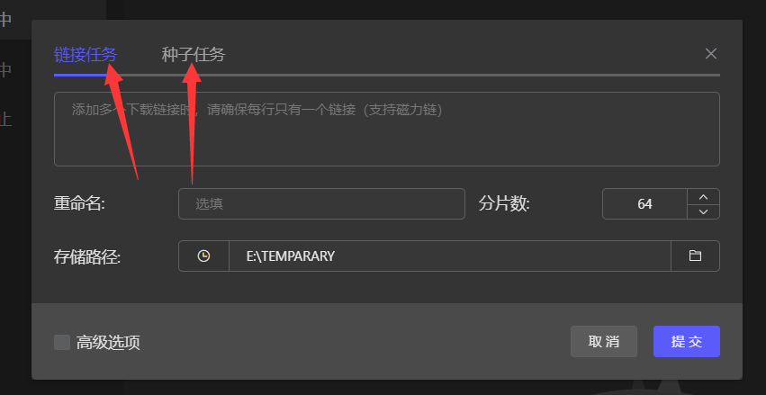
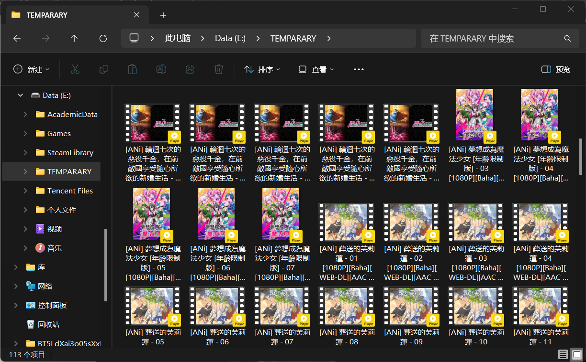
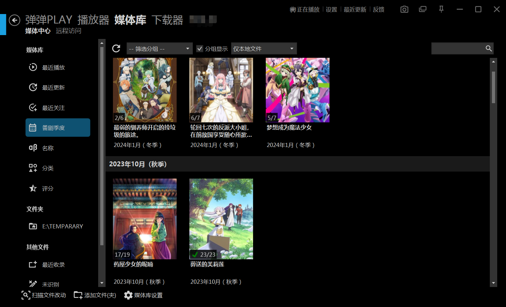
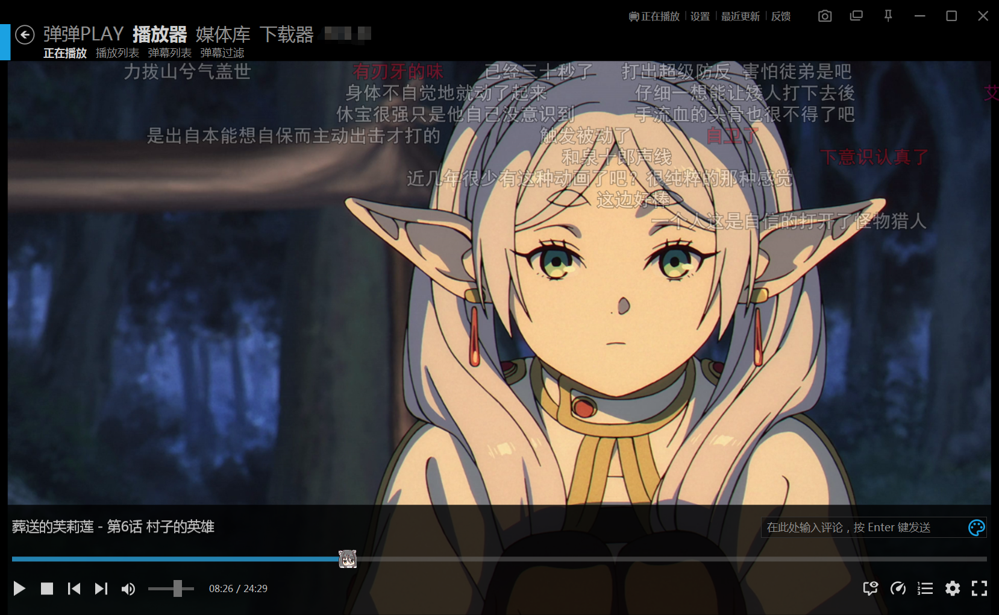
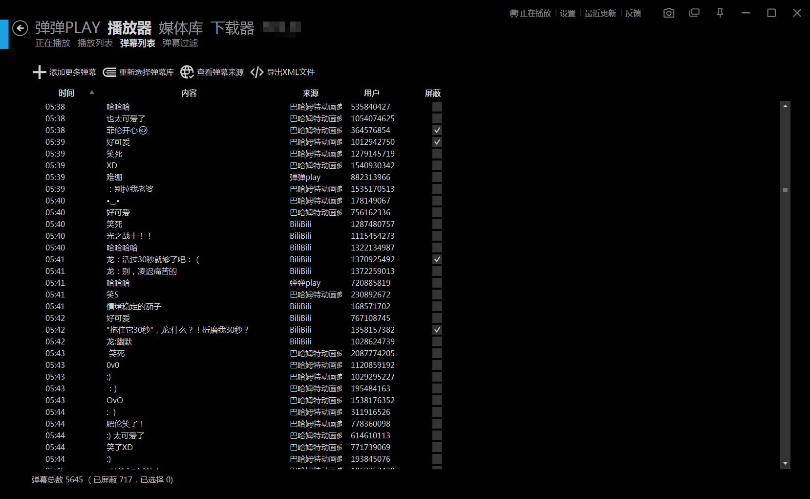

# 新番观看快速入门

***免责声明：本文中所提及所有网站均为互联网搜集，可能包含诈骗、虚假广告、违法信息等内容，请高度警惕并注意自行甄别！如有因本文所列网站造成任何损失的，笔者不会承担任何责任。***

---

# 1. 前言

2021 年 2 月 7 日，哔哩哔哩番剧官号宣布因<strong>“突发技术故障”</strong>下架动画番剧《无职转生》，标志着 2021年初开始的，由哔哩哔哩 up 主**LexBurner**的一系列不当言论引发的，该动画炎上事件的告一段落。

受此事件影响，早在酝酿中的<strong>“先审后播”</strong>制度被加速提上日程，该制度在 2021年四月档动画首次正式实行，进一步引发了对进口文化产品的全面收缩和限制。如今看来，“先审后播”政策杀伤力极大，基本断绝了简体中文观众观看正版番剧的途径。

本文旨在为读者提供一系列观看日本新番动画的途径，这些途径大都是不被公开承认的，因此请谨慎传播本文，并在有能力的情况下尽量支持正版。

# 2. 新番观看入门教程

## 2.0 总览

新番动画观看方式按照 **正版与否** 可分为**正版观看/盗版观看** ；按照 **视频源** 可分为**流媒体观看/本地观看** 。
右侧列出了分别对应的观看方式。本文将进行逐一介绍。 其中， **BT网站下载** 是我个人最推荐的方式。

| - | **正版观看** | **盗版观看** |
| --- | --- | --- |
| **流媒体观看** | 正版网站 | 盗版网站 |
| **本地观看** | BD 光碟 | BT 网站下载 |

## 2.1 正版网站

正版平台大多需要付费，但是能保证及时、稳定的更新以及较为优质的视听体验。

- 国内正版环境在受到 **先审后播**的重大打击后，仍然残存了小规模的正版生态，但经常出现删减与和谐，哔哩哔哩等平台仍然在尽力进行新番引进工作，读者可以在它们的官网查看正版引进番剧。
- 墙外的正版环境较为丰富，同时需要特殊的上网手段。常见有中文字幕的平台及对应地区如下：
    - 巴哈姆特-中国台湾：[https://acg.gamer.com.tw/anime/](https://acg.gamer.com.tw/anime/)
    - 哔哩哔哩出差-港澳台：[https://space.bilibili.com/11783021](https://space.bilibili.com/11783021)
    - NETFLIX -环大陆：[https://www.netflix.com/](https://www.netflix.com/)
    - VIU -中国香港：[https://www.viu.com/](https://www.viu.com/)
    - ……

哔哩哔哩 up 主 [**长门有C**](https://space.bilibili.com/30160/) 制作的新番表内容详实，他会统计每季度番剧正版情况，读者可进入查看：

:::tip[外部链接]
[長門番堂 - YuC's AnimeList](https://yuc.wiki/)
:::

## 2.2 BD 光碟

有 BD 光碟的不用看这个教程，在此略去。

## 2.3 盗版网站

盗版流媒体网站具有广告多、资源质量良莠不齐、存活时间短的缺点，也有着方便快捷、适合移动端的特点，部分网站甚至架设了较为完善的弹幕系统。下面的列表总结了一部分盗版网站：

| 名称         | 平台           | 特点                                                    | 网址                                                       |
| :----------- | :------------- | :------------------------------------------------------ | :--------------------------------------------------------- |
| 稀饭动漫     | 网页端+手机APP | 资源更新较及时、质量较高 有弹幕系统                      | https://xn--6fr867dwnhpu5a.com/ http://www.xfani.com/ |
| AGE动漫      | 网页端+手机APP | 资源更新较及时                                          | http://agefans.com/                                        |
| omofun       | 网页端+手机APP | 资源更新及时、质量较高 手机端有弹幕系统且弹幕数量多      | https://omofun.in/                                         |
| LIBVIO       | 网页端+手机APP | 资源质量较高                                            | https://www.libvio.app/                                    |
| アニメ新番組 | 网页端         | 资源更新及时、**目前暂停新用户注册**                    | https://bangumi.online/                                    |
| 哔哩哔哩     | 网页端+手机APP | 绝大部分国内不存在正版代理的动画都可以在B站找到用户盗传 | https://bilibili.com/                                      |
| ……           |                |                                                         |                                                            |

## 2.4 BT 网站下载

### 2.4.1 优缺点

BT 网站下载后本地播放是最推荐的的观看方法。其具有以下优点：

1. 资源质量最高、更新最及时：各大发布组通常会在第一时间做种上传正版网站获取的高清源，字幕组完成施工后也会第一时间发布在bt 站
2. 存活时间长：BT 去中心化的下载特性保证了资源的长时间存活
3. 无卡顿：BT 下载方式快，本地视频播放无卡顿
4. 可选范围大：可以自行选择官方中文字幕（如果有）或是其他民间字幕组的字幕文件，也可以自选清晰度下载
5. 本地播放易于个性化：通过调整本地播放器设置，可个性化播放体验
6. 弹弹 play 播放器可实现个性化番剧管理，有独立弹幕生态
7. 进阶玩法多样：nas 自动下载等
8. ……

当然，也有如下缺点：

1. 门槛高：需要进行一系列本地配置
2. 不适用移动端：移动端进行 BT 下载相对困难
3. 老资源下不动：老资源在线少，下载慢

### 2.4.2 下载教程

由于本文为入门级教程，在此仅介绍一款免费、开源、友好的 BT下载软件：[**Motrix**](https://motrix.app/zh-CN/)

:::tip[外部链接]
[Motrix下载管理器 - A full-featured download manager](https://motrix.app/zh-CN/)
:::

1. 下载安装好以后，在设置>进阶设置中勾选 **每天自动更新Tracker服务器** ，然后在 **Tracker服务器** 下拉栏中勾选所有选项，点击右侧 **更新按钮** 等待更新完成。最后 **保存并应用**
   
    
    
    
    
2. 单击左侧 + 号新建下载任务
   
    
    
3. 在 BT资源站获取种子或者磁力链接后，在此处键入，点击**提交**按钮开始下载。此处<strong>“存储路径”</strong>建议选择空闲的盘的路径。
   
    
    

**注意事项：**

- 极度不建议使用 <strong>“迅雷”</strong>下载新番动画，它的无耻操作严重影响了国内的 BT生态，不少字幕组做种时也已禁用迅雷。具体事件可以“迅雷+吸血”为关键词在搜索引擎搜索。在资源久远、普通 BT软件难以下载的情况，可以考虑使用迅雷
- 一定注意新番文件夹的定时清理
- 新番文件夹可以根据个人习惯分文件夹存储番剧，若懒得整理可以堆在同一个文件夹，使用弹弹
play 等软件进行管理，该软件将在 2.4.4 节进行介绍

### 2.4.3 BT 网站列表

| 网站名称       | 墙内/外 | 特点                                                 | 网址                                                       |
| :------------- | :------ | :--------------------------------------------------- | :--------------------------------------------------------- |
| 動漫花園       | 外      | 目前最大的中文动画BT站                               | https://www.dmhy.org/                                      |
| Nyaa           | 外      | 全球最大的动画BT站 以生肉资源为主                     | https://nyaa.si/                                           |
| 蜜柑计划       | 均有    | 按字幕组、季度、更新时间分门别类整理了资源，界面友好 | （外）https://mikanani.me/ （内）https://mikanime.tv/ |
| ACG.RIP        | 外      |                                                      | https://acg.rip/                                           |
| 萌番组         | 外      |                                                      | https://bangumi.moe/                                       |
| 爱恋动漫       | 内      |                                                      | https://kisssub.org/                                       |
| SUBSPLEASE     | 内      | 以生肉资源为主                                       | https://subsplease.org/                                    |
| 菲特动漫       | 内      |                                                      | https://fitacg.com/                                        |
| 末日动漫资源库 | 外      |                                                      | https://share.acgnx.se/                                    |
| ……             |         |                                                      |                                                            |

### 2.4.4 播放教程

BT 网站下载的番剧绝大多数为`.MP4`或`.MKV`格式，它们可以在大多数播放器（包括系统内置播放器）中直接播放。对于希望进一步设置播放器以获得更好的视听体验的，可参阅：

:::tip[外部链接]
[我们爱科普 | VCB-Studio](https://vcb-s.com/archives/category/kb)
:::

### 2.4.4.1 弹弹 play 介绍

**弹弹 play** 作为一款*全功能“本地视频 + 弹幕”播放器*，功能多样、丰富，涵盖了从资源搜集、资源下载到本地播放、弹幕互动的全过程，堪称动画追番一站式解决方案。

:::tip[外部链接]
[弹弹play - 全功能“本地视频+弹幕”播放器](https://www.dandanplay.com/)
:::

其中最实用的当属 **资源管理** 和**弹幕互动** 两个功能。

- 如下图，弹弹 play可自动将同一文件夹下杂乱无章的视频文件按照番剧归类，再将番剧按照季度、播放时间等进行分类，降低了资源管理难度

- 弹弹 play的招牌功能是独立的弹幕生态和全网弹幕爬取，如下图，可以集合哔哩哔哩、巴哈姆特等多个平台的弹幕，加上较为完善的弹幕个性化、弹幕屏蔽功能，极大丰富了追番体验

# 3. 征集

本文中的网址列表需要长期更新，欢迎读者将自己发掘的网站按照本文表格中的信息格式发送到评论区或填入下方收集表格，谢谢！

:::tip[外部链接]
[点击进入飞书收集表格](https://kzvqchvcrl.feishu.cn/sheets/PjkWsJCGQhrI8btass8chxZknyb?from=from_copylink)
:::

# 4. 结语

感谢您的阅读，再次声明：***本文中所提及所有网站均为互联网搜集，可能包含诈骗、虚假广告、违法信息等内容，请高度警惕并注意自行甄别。如有因本文所列网站造成任何损失的，笔者不会承担任何责任。***

本文最早是笔者为厦大静迹动漫社所写的一篇教程文字。中文互联网上的动画曾经历过蛮荒的盗版时代、火热的大正版时代、以及在夹缝中求生存的后正版时代——也就是我们的现在。笔者完整地经历了大正版时代火热的版权战争、以及先审后播的酝酿与实施、直到现在的落寞萧条，只能留下一声叹息。

祝愿您能愉快追番。
