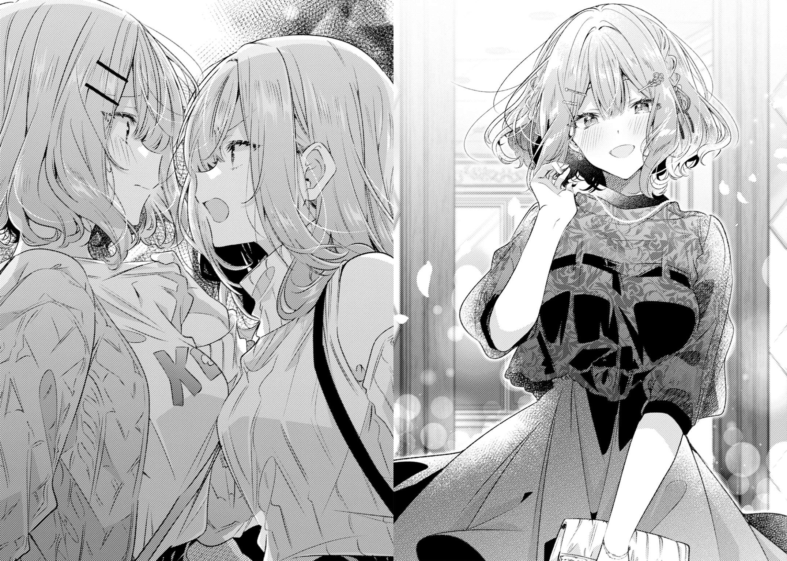

:::note
这篇文字是8月1日写的，现迁移到博客。
:::

> 书名：[**わたしが恋人になれるわけないじゃん、ムリムリ！（※ムリじゃなかった!?）**](https://bgm.tv/subject/300270) 【我们不可能成为恋人！绝对不行。 （※似乎可行？）】
>
> 作者：[みかみてれん](https://bgm.tv/person/32290)
>
> 插画：[竹嶋えく](https://bgm.tv/person/25907)

这几天一有空闲时间就在看《恋人不行》的漫画和原作小说，一口气补完了六十多话漫画和四到七一共四卷轻小说。

读下来最大的感受就是：第七卷跟前几卷的审美价值不在一个level——前面的几卷还是欢乐闹腾的百合后宫喜剧，第七卷才真正把玲奈子的人物形象立住。最后间章回忆里我读到玲奈子剪刘海、遥奈在门外痛哭的时候狠狠看泪目了。

迈出改变的一步真难啊，读第七卷之前一直感觉玲奈子“想变成阳角！”和“不想被别人知道我其实是阴沉宅女”的理由又俗又油，读完才意识到这其实是她对抗创伤和痛苦的方式，她在以自己的方式挣扎和战斗。相信总有一天她能走出阴影，骄傲地面对自我和过去。

同为竹岛笔下的角色，玲奈子和遥奈这对骨科百合cp很难不被拿来跟《恋语轻唱》比较，但是她们给人的感觉其实差很多，恋人不行的这对还是可以解读在正常的姐妹家人的牵绊和憧憬范围之内的，恋语轻唱的那对就露骨很多了。遥奈是个好妹妹，玲奈子也是个好姐姐。

最后不得不说，七卷封面的长发玲奈子数值太无敌了，太好看了。虽然看起来又邋遢又阴沉，但是从这里她真正地开始凭自己的意志坚强地面对这个世界。

